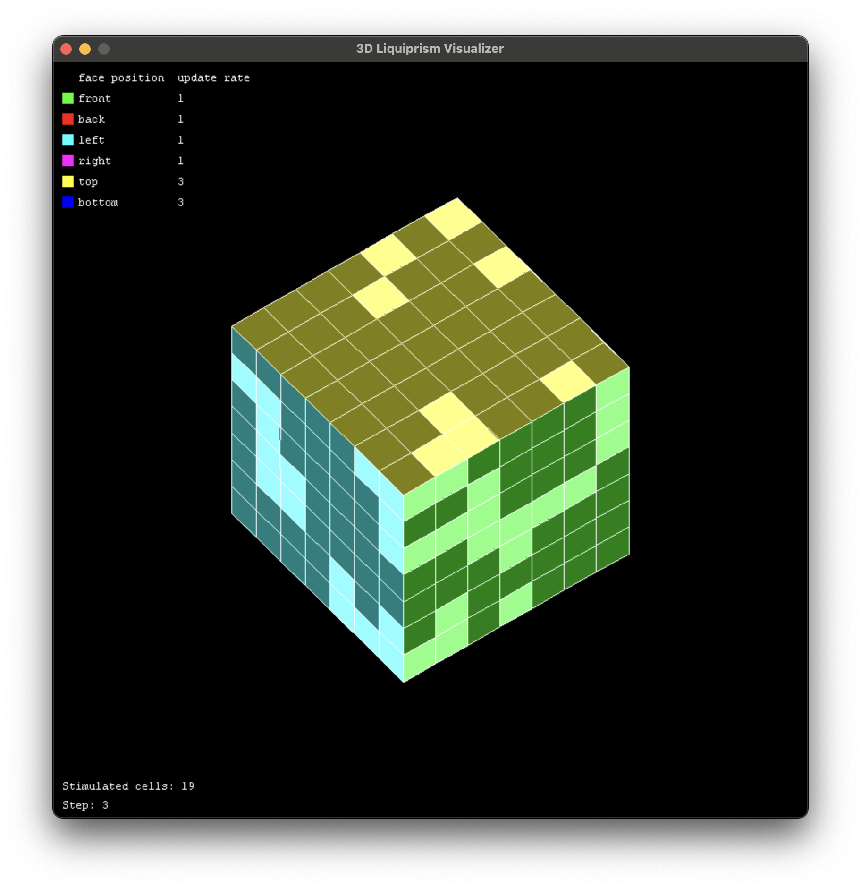
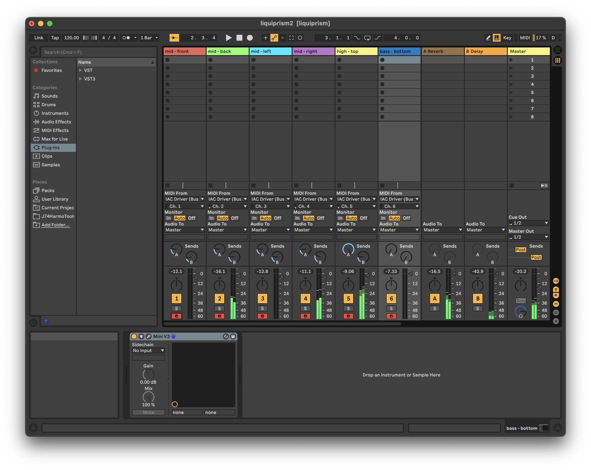
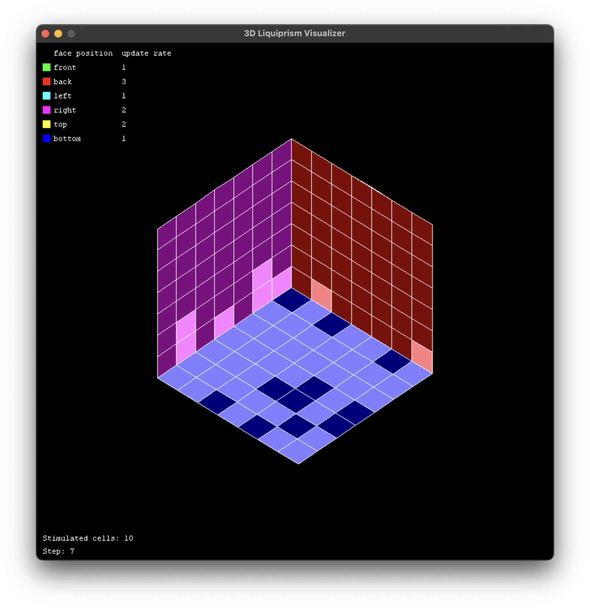

# Liquiprism: Polyrhythmic Music Generation with Cellular Automata

The **Liquiprism** project is a Python-based implementation of a generative music system that uses **cellular automata** to create **polyrhythmic music**. Inspired by the paper [*Liquiprism: Generating Polyrhythms With Cellular Automata*](http://www.icad.org/websiteV2.0/Conferences/ICAD2002/proceedings/36_AlanDorin.pdf), this system generates real-time MIDI sequences that can be sent to a DAW (Digital Audio Workstation) for sonification. The project is designed to provide a creative tool for musicians and composers to explore new sonic possibilities.




## Features

- **Cellular Automata**: Uses a 3D grid of cells to generate polyrhythmic patterns.
- **Real-Time MIDI Output**: Sends MIDI notes to a DAW for real-time playback.
- **Six Instruments**: Supports six different instruments for sonification, each mapped to a face of the 3D grid.
- **Interactive Visualization**: Includes a 3D visualizer to observe the cellular automata in action.
- **Customizable Parameters**: Allows adjustment of grid size, update rates, and activation probabilities.

## Prerequisites

- **Python 3.10**
- **Pygame**: For visualization.
- **Mido**: For MIDI output.
- **NumPy**: For numerical operations.

## Installation

1. Clone the repository:
   ```bash
   git clone https://github.com/smc24-musicgen/paper-implementation-theo.git
   cd paper-implementation-theo
   ```

2. Install the required dependencies:
   ```bash
   pip install -r requirements.txt
   ```

3. Set up your MIDI environment:
   - Ensure your DAW is configured to receive MIDI input from the `IAC Driver Bus 1` (macOS) or a virtual MIDI port (Windows/Linux).

---

## Usage

### 1. **Running the Visualizer and MIDI Generator**
   - Run the `main.py` script to start the Liquiprism system:

     ```bash
     python main.py
     ```
   - This will:
     - Open a 3D visualizer window to display the cellular automata grid.
     - Send MIDI notes to your DAW in real-time.

### 2. **Interacting with the Visualizer**
   - Use the following keys to interact with the visualizer:
     - **Arrow Keys**: Rotate the 3D grid.

### 3. **Customizing Parameters**
   - Modify the following variables in `main.py` to customize the behavior:

     ```python
     SIZE = 7  # Size of the grid (e.g., 7x7)
     RANDOM_UPDATE_RATE = True  # Randomize update rates for each face
     STEP_TIME = 1000  # Time between steps in milliseconds
     ```

     _Keep in mind that the size is specifically set to 7 to have an octave in the key of Cmaj per row. So modifying the size can cause unexpected behaviour._

### 4. **Adjusting MIDI Output**
   - Modify the `Sonifier` class in `sonifier.py` to change the MIDI channel, instrument mappings, or note thresholds.

---

## Key Components

### 1. **Cellular Automata**
- The `Liquiprism` class implements a 3D grid of cells, where each face of the grid represents a different instrument.
- Cells evolve based on rules inspired by Conway's Game of Life, with additional stochastic and stimulus rules.

### 2. **MIDI Sonification**
- The `Sonifier` class maps the state of the cellular automata to MIDI notes, sending them to a DAW for playback.
- Each face of the grid is mapped to a different MIDI channel and instrument.

### 3. **3D Visualization**
- The `Visualizer` class uses Pygame to render a 3D representation of the cellular automata grid.
- Users can rotate the grid and observe the evolution of the cells in real-time.

---

## Output Explanation

When you run the program, it will generate **polyrhythmic music** in real-time and display the cellular automata grid in a 3D visualizer. Here’s what you can expect:

### 1. **MIDI Output**
- The program sends MIDI notes to your DAW, every face is mapped to a different MIDI channel.
  - **Front**: 1
  - **Back**: 2
  - **Left**: 3
  - **Right**: 4
  - **Top**: 5
  - **Bottom**: 6



### 2. **Visualizer**
- The 3D visualizer displays the cellular automata grid, with each face colored differently.
- Cells that are "alive" are shown in lighter colors, while "dead" cells are shown in darker ones.
- The grid rotates in response to user input, allowing you to observe the system from different angles.



## Troubleshooting

- **MIDI Not Working**:
  - Ensure your DAW is configured to receive MIDI input from the correct port (`IAC Driver Bus 1` on macOS or a virtual MIDI port on Windows/Linux).
  - Verify that the `mido` library is installed correctly.

- **Visualizer Not Displaying**:
  - Ensure Pygame is installed and that your system supports OpenGL.
  - Check for any error messages in the console.

- **Performance Issues**:
  - Reduce the grid size (`SIZE` in `main.py`) or increase the step time (`STEP_TIME`) to improve performance.

